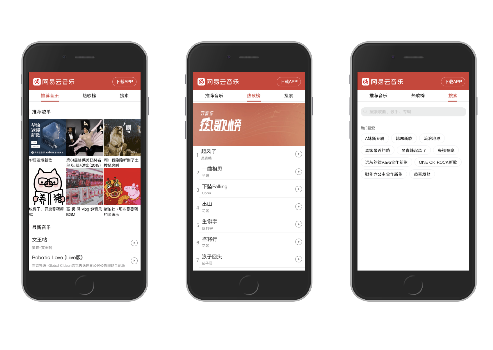
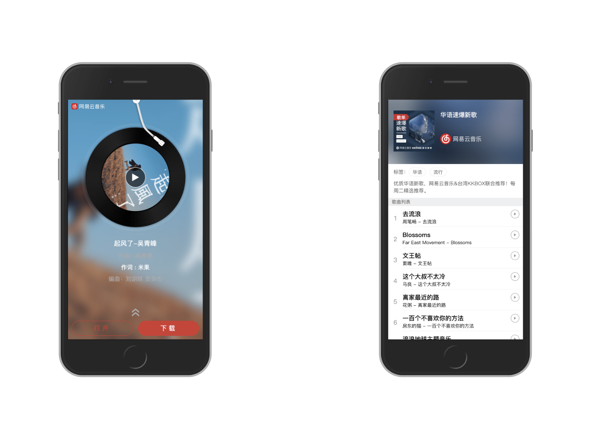

# Music-163
### 开始

1. git clone git@github.com:xiaoxinwan/music-163.git
2. npm install 
3. npm start 
4. 进入http-server提供的url，如（http://127.0.0.1:8080/song.html）
5. git clone git@github.com:Binaryify/NeteaseCloudMusicApi.git
6. npm install
7. node app.js 启动本地服务器

### 预览
**首页**

**播放页、歌单详情页**

### 技术栈
JQuery + JS 

NeteaseCloudMusicApi 网易云音乐NodeJS版API，提供音乐数据

### 实现功能
首页、歌单详情、音乐播放页面

#### 首页
首页分为三个部分：推荐音乐、热歌榜、搜索页

#### 音乐播放页
使用原生HTML的audio实现播放、暂停

歌词部分，先获取歌词数据，然后对比歌词中的时间和播放时间，利用transform实现滚动

### 谢谢
感谢 [Binaryifyp](https://github.com/Binaryify) 提供的接口 [NeteaseCloudMusicApi](https://binaryify.github.io/NeteaseCloudMusicApi/#/?id=neteasecloudmusicapi) 
